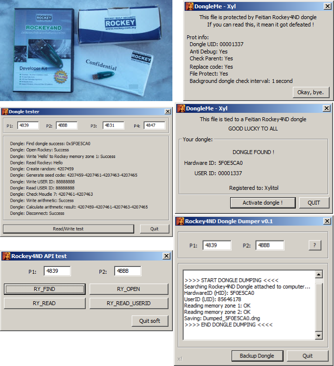

# DongleMe

## INTRODUCTION

This project uses the [MASM32 SDK](https://www.masm32.com/) and [WinASM](https://code.google.com/archive/p/winasm-studio/).  
  
That just some materials i did for a presentation and a paper (private sorry) about software protection for a con in 2017.  
This repository include code projects in assembly to try my Rockey4ND dongle and an emulator tied to it compatible with theses codes.

## BUILDING

There is a file, called **make.bat**, which will build the executable file for theses projects.  
Reading this file is the way to understand the build process.

- /DongleAPI/  - Utility to try to interact with a plugged dongle
- /DongleTest/ - Utility doing multiple write/read operations, based on the Feitian SDK V1.30 examples
- /DongleMe/Envelope/ - Empty shell, for the Feitian Shell Protect Center 1.0.10.105
- /DongleMe/NoEnvelope/ - Very basic example on how to tie a program to a dongle without Feitian Shell Protect Center
- /DongleDump/ - Utility to dump the memory zone 1 and memory zone 2 of a Rockey4ND dongle

## WHAT'S INTERESTING?

You will have fews examples on how to [import](/DongleMe/NoEnvelope/dongleme.asm#L125) the ROCKEY4ND DLL API Library in resource file, drop it and load it.  
Another interesting code can be my [procedure](/DongleAPI/dongleapi.asm#L75) who take P1 and P2 from user and move it into a DW variable.  
DongleDump include also a procedure who hex write and another for [wrapping the text](/DongleDump/dongleDump.asm#L308) with comas, backward slash and carriage return.

If you want to play with my emulated dongle the 4 passwords are:  
P1: **4839**  
P2: **4BBB**  
P3: **4B31**  
P4: **4847**  

